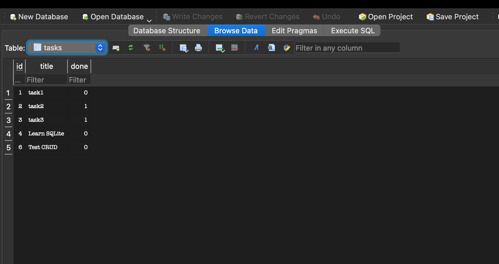

# Task API

A RESTful CRUD API built using Node.js, Express.js, and SQLite.

This project was developed as part of the **FlyRank Backend AI Engineering Internship**.

The project originally started as an in-memory CRUD API in Week 2. In Week 3, the storage layer was migrated from a JavaScript array to a persistent SQLite database while keeping the same API endpoints and behavior.

The main idea demonstrated by this project is that the API layer and data-storage layer are independent:

```text
Client -> Express API -> SQLite Database
```

The client continues using the same endpoints, while tasks are now stored permanently in a database and survive server restarts.

---

## Features

- Create a new task
- Retrieve all tasks
- Retrieve a task by ID
- Update an existing task
- Delete a task
- Persistent task storage using SQLite
- Automatic database creation
- Automatic table creation
- Automatic seed data when the table is empty
- Input validation
- Parameterized SQL queries
- Proper HTTP status codes
- Health check endpoint
- Interactive API documentation using Swagger UI
- Database inspection using DB Browser for SQLite

---

# Technology Stack

- Node.js
- Express.js
- SQLite
- better-sqlite3
- Swagger UI Express
- OpenAPI 3.0
- DB Browser for SQLite

---

# Project Structure

```text
task-api/
│
├── controllers/
│   └── task.controller.js
│
├── routes/
│   └── task.routes.js
│
├── docs/
│   ├── swagger-screenshot.png
│   └── sqlite-db-browser.png
│
├── db.js
├── server.js
├── swagger.json
├── package.json
├── package-lock.json
├── .gitignore
└── readme.md
```

The SQLite database file:

```text
tasks.db
```

is generated automatically when the application starts and is excluded from Git using `.gitignore`.

---

# Architecture

## Week 2

The original application stored tasks inside a JavaScript array:

```text
Client
   ↓
Express API
   ↓
In-memory JavaScript Array
```

This meant all data disappeared whenever the server restarted.

## Week 3

The application now stores tasks inside SQLite:

```text
Client
   ↓
Express API
   ↓
SQLite
   ↓
tasks.db
```

The API endpoints remain the same.

Only the storage implementation changed.

This demonstrates an important backend engineering principle:

> The API defines what the application does, while the database defines where the application stores its data.

---

# Installation

## 1. Clone the repository

```bash
git clone https://github.com/Aryanbharti214/task-api.git
```

## 2. Navigate to the project directory

```bash
cd task-api
```

## 3. Install dependencies

```bash
npm install
```

## 4. Start the server

```bash
node server.js
```

The server will start at:

```text
http://localhost:3000
```

---

# Automatic Database Setup

No separate SQLite server or database installation is required.

When the application starts, `db.js` automatically opens or creates:

```text
tasks.db
```

The application also automatically creates the `tasks` table if it does not already exist.

The table contains:

| Column | Type | Description |
|---|---|---|
| `id` | INTEGER | Primary key that uniquely identifies a task |
| `title` | TEXT | Title of the task |
| `done` | BOOLEAN | Whether the task is completed |

If the `tasks` table is empty when the application starts, three example tasks are inserted automatically.

This prevents example tasks from being duplicated during normal server restarts while still allowing a fresh clone of the project to initialize itself automatically.

---

# Why SQLite?

SQLite was chosen because it is lightweight and simple to use for a small backend project.

Unlike databases such as PostgreSQL or MySQL, SQLite does not require a separate database server.

The entire database is stored inside a single file:

```text
tasks.db
```

Advantages for this project include:

- No separate database server required
- Zero database configuration
- Data persists after server restarts
- Easy local development
- Single-file database
- Easy inspection using DB Browser for SQLite
- Good introduction to SQL and relational databases

---

# Database Persistence

In the previous version of this project, tasks were stored in memory.

For example:

```javascript
let tasks = [];
```

When the Node.js process stopped, the data disappeared.

The current version stores tasks in SQLite.

For example:

```sql
INSERT INTO tasks (title, done)
VALUES (?, ?);
```

Because SQLite writes the data to `tasks.db`, tasks remain available even after the Node.js server stops and starts again.

Example flow:

```text
Create task
    ↓
POST /tasks
    ↓
INSERT INTO SQLite
    ↓
Stop server
    ↓
Restart server
    ↓
GET /tasks
    ↓
Task still exists
```

---

# API Endpoints

| HTTP Method | Endpoint | Description |
|---|---|---|
| GET | `/` | Returns API information |
| GET | `/health` | Returns server health status |
| GET | `/tasks` | Returns all tasks |
| GET | `/tasks/:id` | Returns a task by ID |
| POST | `/tasks` | Creates a new task |
| PUT | `/tasks/:id` | Updates an existing task |
| DELETE | `/tasks/:id` | Deletes a task |

---

# Swagger Documentation

Interactive API documentation is available through Swagger UI.

After starting the server, open:

```text
http://localhost:3000/api-docs
```

Swagger UI allows each endpoint to be tested directly using the **Try it out** feature.

## Swagger UI Screenshot


---

# API Usage

## Get All Tasks

### Request

```http
GET /tasks
```

### curl

```bash
curl -i http://localhost:3000/tasks
```

### Example Response

```json
{
  "message": "All Tasks",
  "taskList": [
    {
      "id": 1,
      "title": "task1",
      "done": false
    },
    {
      "id": 2,
      "title": "task2",
      "done": true
    }
  ]
}
```

---

# Get Task by ID

### Request

```http
GET /tasks/:id
```

### Example

```bash
curl -i http://localhost:3000/tasks/1
```

### Example Response

```json
{
  "task": {
    "id": 1,
    "title": "task1",
    "done": false
  }
}
```

If the task does not exist:

```http
HTTP/1.1 404 Not Found
```

```json
{
  "error": "Task not found"
}
```

---

# Create a Task

### Request

```http
POST /tasks
```

### Request Body

```json
{
  "title": "Learn SQLite"
}
```

### curl

```bash
curl -i -X POST http://localhost:3000/tasks \
-H "Content-Type: application/json" \
-d '{"title":"Learn SQLite"}'
```

### Example Response

```http
HTTP/1.1 201 Created
```

```json
{
  "message": "Task Created successfully",
  "task": {
    "id": 4,
    "title": "Learn SQLite",
    "done": false
  }
}
```

The task is inserted into SQLite using an SQL `INSERT` query.

---

# Update a Task

### Request

```http
PUT /tasks/:id
```

### Example

```bash
curl -i -X PUT http://localhost:3000/tasks/4 \
-H "Content-Type: application/json" \
-d '{"done":true}'
```

### Example Response

```json
{
  "message": "task updated successfully",
  "task": {
    "id": 4,
    "title": "Learn SQLite",
    "done": true
  }
}
```

The task is updated using an SQL `UPDATE` query.

---

# Delete a Task

### Request

```http
DELETE /tasks/:id
```

### Example

```bash
curl -i -X DELETE http://localhost:3000/tasks/4
```

Successful deletion returns:

```http
HTTP/1.1 204 No Content
```

The task is removed using an SQL `DELETE` query.

---

# Input Validation

The API validates incoming data before interacting with the database.

For example, creating a task without a valid title returns:

```http
HTTP/1.1 400 Bad Request
```

Example invalid request:

```bash
curl -i -X POST http://localhost:3000/tasks \
-H "Content-Type: application/json" \
-d '{}'
```

Requests for tasks that do not exist return:

```http
HTTP/1.1 404 Not Found
```

---

# HTTP Status Codes

| Status Code | Description |
|---|---|
| `200` | Request completed successfully |
| `201` | Task successfully created |
| `204` | Task successfully deleted |
| `400` | Invalid request body |
| `404` | Task not found |

---

# Parameterized SQL Queries

Database queries use parameterized placeholders rather than directly inserting user input into SQL strings.

Example:

```javascript
db.prepare("SELECT * FROM tasks WHERE id = ?").get(id);
```

Instead of:

```javascript
db.prepare(`SELECT * FROM tasks WHERE id = ${id}`).get();
```

Parameterized queries keep user-controlled values separate from the SQL command and reduce the risk of SQL injection.

The CRUD operations use SQL queries such as:

```sql
SELECT
INSERT
UPDATE
DELETE
```

---

# SQL Queries Used

During the database exploration stage, SQL queries were also executed manually using DB Browser for SQLite.

## List Every Task

```sql
SELECT * FROM tasks;
```

This query returns every row stored in the `tasks` table.

---

## Show Only Completed Tasks

```sql
SELECT * FROM tasks WHERE done = 1;
```

This query returns only tasks that have been marked as completed.

---

## Count All Tasks

```sql
SELECT COUNT(*) FROM tasks;
```

This query returns the total number of tasks currently stored in the database.

---

## Mark Every Task as Completed

```sql
UPDATE tasks SET done = 1;
```

After executing this query manually in DB Browser, the changes were immediately visible through:

```http
GET /tasks
```

without changing the Express API code.

---

## Delete Completed Tasks

```sql
DELETE FROM tasks WHERE done = 1;
```

This query removes all completed tasks from the database.

The updated database state can immediately be observed through the API.

---

# SQLite Database Screenshot

The database was inspected and modified manually using **DB Browser for SQLite**.

The screenshot below shows the `tasks` table stored inside `tasks.db`.



---

# Persistence Test

Persistence can be verified using the following steps.

## 1. Create a task

```bash
curl -X POST http://localhost:3000/tasks \
-H "Content-Type: application/json" \
-d '{"title":"Persistence Test"}'
```

## 2. Stop the server

```text
Ctrl + C
```

## 3. Restart the server

```bash
node server.js
```

## 4. Retrieve tasks

```bash
curl http://localhost:3000/tasks
```

The previously created task will still exist because it is stored inside SQLite rather than application memory.

---

# Clean Clone Test

The project does not require an existing `tasks.db` file to run.

The database is excluded from Git.

A fresh clone can initialize itself automatically:

```bash
git clone https://github.com/Aryanbharti214/task-api.git
cd task-api
npm install
node server.js
```

On startup:

```text
tasks.db
```

is automatically created.

The application then:

1. Creates the `tasks` table if it does not exist.
2. Checks whether the table is empty.
3. Inserts three example tasks when required.
4. Starts the Express server.

A user cloning the repository therefore does not need to manually create or configure the database.

---

# Storage Layer Migration

The main learning objective of this project was replacing the storage layer without changing the API.

Previously:

```text
GET /tasks
     ↓
JavaScript Array
```

Now:

```text
GET /tasks
     ↓
SQL SELECT
     ↓
SQLite
```

Similarly:

```text
POST /tasks
```

changed internally from:

```javascript
tasks.push(task);
```

to an SQL operation:

```sql
INSERT INTO tasks (title, done)
VALUES (?, ?);
```

The client still sends the same HTTP request.

This demonstrates that persistence is an implementation detail behind the API.

---

# Git Commit Stages

The database migration was developed stage by stage.

```text
Stage 0: create SQLite database
Stage 1: database read endpoints
Stage 2: insert into database
Stage 3: update and delete with SQL
Stage 4: explored SQLite
Stage 5: database documentation
```

Each stage represents a separate part of the migration from in-memory storage to SQLite.

---

# What I Learned

Through this assignment I practiced:

- SQLite database creation
- Database persistence
- Relational database tables
- SQL `SELECT`
- SQL `INSERT`
- SQL `UPDATE`
- SQL `DELETE`
- SQL `WHERE`
- SQL `COUNT()`
- Parameterized queries
- Primary keys
- Database seeding
- Separating API logic from data storage
- Inspecting databases using DB Browser for SQLite
- Verifying database changes through an API

The most important observation from this assignment is that the API itself did not need to change when the storage implementation changed.

The routes remained the same:

```text
GET    /tasks
GET    /tasks/:id
POST   /tasks
PUT    /tasks/:id
DELETE /tasks/:id
```

Only the source of the data changed from an in-memory JavaScript array to SQLite.

---

# Future Improvements

- Search tasks using SQL `LIKE`
- Filter tasks by completion status
- Sort tasks alphabetically using `ORDER BY`
- Add task statistics using SQL `COUNT()`
- Add `created_at` and `updated_at` timestamps
- Add database migrations
- Add automated unit and integration tests
- Add pagination
- Add PostgreSQL support
- Add user authentication and authorization
- Add Docker support

